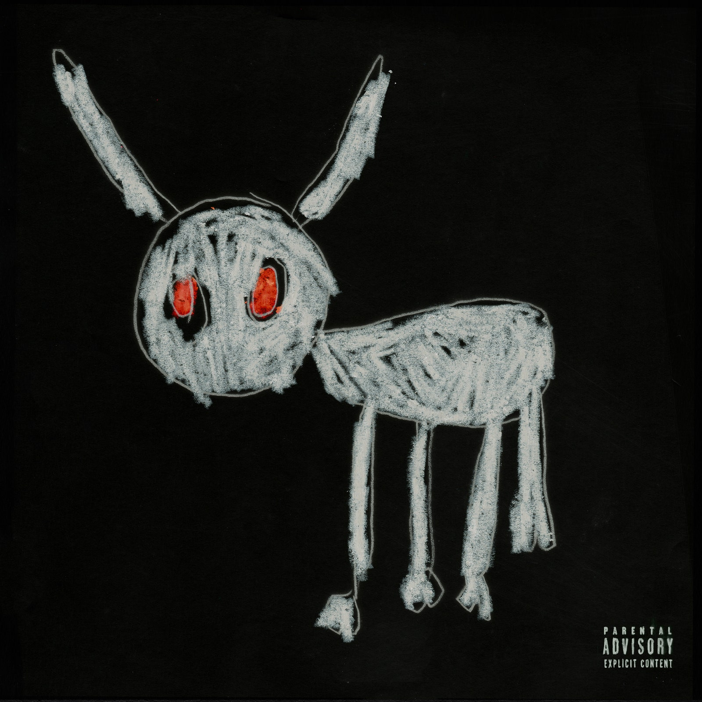

# Abstract Rothko

**The following is a display to confirm that I've learnt how to write in markdown**

## Images

*First Picture*


*Second Picture*



*Third Picture*


## Code Blocks

### SQL

**Create Table**

```sql
CREATE TABLE drakediscography
(
    album_id INT PRIMARY KEY,
    album TEXT,
    lead_single TEXT,
    total_songs INT,
    release_date DATETIME,
    first_week_sales NUMERIC,
    genres VARCHAR(255) 
);
```

**Query the data**

```sql
SELECT *
FROM drakediscography
WHERE release_date > '2020-01-01';
```

### Python

**Importing external libraries**

```python
# Import libraries
import pandas as pd
import numpy as np
import matplot.pyplot as plt
Import seaborn as sns

from random import randint as ri

# Import dataset
df = pd.read_csv("nisioisin_unpublished_works")

```

**Exploring the dataset**

```python

df.shape

```

```python

df.info()

```

```python

df.describe()

```

```python

df.head()

```

```python

df.tail()

```

```python

df.sample()

```


## Checklist

### Nisioisin Novels to Read

**Monogatari's _Monster Season_**

- [x] Shinobumonogatari
- [x] Yoimonogatari
- [x] Amarimonogatari
- [ ] Ougimonogatari
- [ ] Shinomonogatari I
- [ ] Shinomonogatari II

**The Boukyaku Tantei Series**

- [x] The Memorandum of Okitegami Kyouko
- [x] The Testimonial of Okitegami Kyouko
- [ ] The Challenge of Okitegami Kyouko
- [ ] The Testament of Okitegami Kyouko
- [ ] The Resignation Letter of Okitegami Kyouko


**Rothko**: "Until we meet again."
